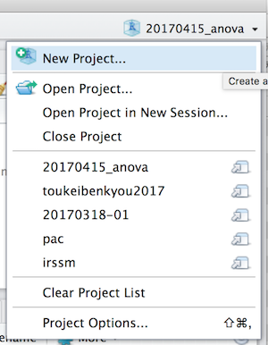
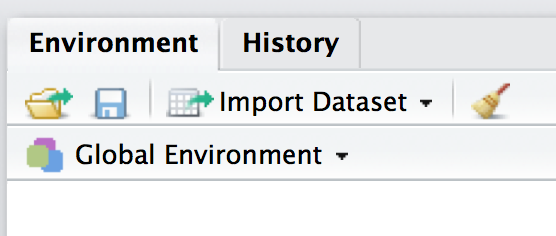
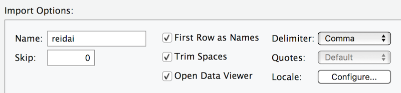
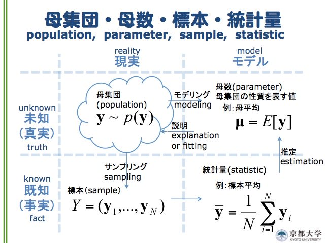

## ゼミ前勉強会

<div>
<center>
*統計学エンドユーザーのための分散分析（1）*  
*2017年4月15日（土）*
</center>
</div>

## 勉強会の目的

1.　統計学エンドユーザーが知っておいたほうがいい手法を身につける。

2.　量的分析を使った研究が理解できるようになる。

3.　Rを使った量的分析ができるようになる。

## 今日の内容

* （復習）R の機能追加と呼び出し
* （復習）データの読み込み方
* tidy なデータとデータの型
* 一元配置の分散分析（一要因の分散分析）
* 練習問題

## R の機能追加と呼び出し

* R はベースのままでもいろいろできる。
* 機能追加でもっとできるようになる。
* スマホのアプリ追加みたいなもの。
* 「アプリをインストール→タップして使う」に似てる。

---

* 例）"car"パッケージをインストールして使えるようにするには。

```{r, eval=FALSE}
install.packages("car")
library(car)
```

* 全部入力しなくも，途中で tab キーで入力補完。
* intall.packages は ”” が必要。library 時は不要。
* インストールは1度だけでOK。
* RStudio を終了して，また起動した時に呼び出す必要あり。

```{r, eval=FALSE}
library(car)  # 全部半角英数。スペルミスに注意。
```

* 分析する時の「ルーチン（by 五郎丸）」だと思おう！

##データの読み込み方

<div class="double">
<p class="double-flow">
* 便利な「プロジェクト」



* RStudio の右側にある。
* フォルダ名には日本語を使わない。
* 分析データをプロジェクトのフォルダに入れておく。
* その他，いろいろ入れておくと便利。
</p>
</div>

---

* データは基本，CSV かタブ区切りのテキストで。
* RStudio を使って GUI で読み込むのが便利。
* 右上の「Import Dataset」をクリック。



---

* Browse でデータを選ぶ。
* プレビューで確認。
* オプションは元データによって変わる。



* OKなら右下の Import

# やってみよう

## データのインポートの練習

1. プロジェクト（プロジェク名は半角英数）を作成し，
2. そこに reidai.csv を入れて，
3. reidai.csv を読み込む。

## データには型がある

* データの型はとても重要！
* 有名なアイリス iris データで確認。

```{r}
str(iris)
```

---

* Titanic データで確認。

```{r}
str(Titanic)
```

* インポートした reidai データを確認してください。

---

```{r, include=FALSE}
library(tidyverse)
reidai <- read_csv("~/Dropbox/02-research/01-document/00JAIST/toukeibenkyou2017/20170415_anova/reidai.csv")
```

```{r}
str(reidai)
```

---

* 列（縦）が変数。1列に1変数。
* 行（横）が観測。1人のデータが1行に入っている。

```{r, eval=FALSE}
head(reidai)
```

```{r}
head(reidai, 3)
```

* これが「tidy なデータ」。

---

* 分析前のデータはエクセルで作ることが多い。
* tidy なデータセットを作るように心がける。
* だいたいのエラーは分析データの不備やデータの型のまちがい。

## 一元配置／一要因の分散分析

* 分散分析 Analysis of variance，略して ANOVA（あのーば）。
* R による分散分析はデータの型に気をつける。
* t 検定が2グループ，分散分析は3グループ（群）以上と言われる。

*ウソです。*

* ANOVA は別に2群でもOK。ただ一般的には3群以上。

## 応答変数と説明変数

* 年収は業種（X, Y, Z）ごとによって違うのかな？
* 店舗の売り上げは立地（A, B, C, D）よって異なるのか？

応答（従属）変数＝年収，店舗の売り上げ  
説明（独立）変数＝業種（X, Y, Z），立地（A, B, C, D）

## 分散分析とは

* 何らかの影響（効果）によって，それぞれの平均値が変わるかどうかを調べるのが分散分析[@baba2015]。

```{r, echo=FALSE, fig.height=3, message=FALSE, warning=FALSE}
df = data.frame(
 X = rnorm(1000, mean=10, sd=2),
 Y = rnorm(1000, mean=3, sd=2),
 Z = rnorm(1000, mean=7, sd=2)
)
df %>% gather() %>% ggplot(aes(x=value, colour=key, fill=key)) +
  geom_density(stat = "density", position = "identity", alpha=0.3)
```

---

業種Xの平均年収 ～ 全業種の平均年収＋業種Xの効果＋誤差X（残差）  
業種Yの平均年収 ～ 全業種の平均年収＋業種Yの効果＋誤差Y（残差）  
業種Zの平均年収 ～ 全業種の平均年収＋業種Zの効果＋誤差Z（残差）

* 効果と残差をゴニョゴニョしてF値（F比）を出し，F検定を行って，p値を出して，有意かどうかを判断するのが分散分析。
* 応答変数が正規分布に従い，等分散であることが前提[@rtoukei2017]。
* １要因で３水準の分散分析。

## 例題 reidai データを使った分散分析

* 婚姻状況によって，食生活の意識は上がるか？[@jisui]

```{r, echo=FALSE, message=FALSE, warning=FALSE, fig.height=3}
reidai %>% ggplot() + geom_violin(aes(x=factor(marriage), y=syoku_kenko))
```

---

応答変数は食生活の意識，説明変数は婚姻状況

```{r, eval=FALSE}
res = lm(syoku_kenko ~ factor(marriage), data = reidai)
anova(res)
```

* エルエムかっこ，応答変数 にょろ 説明変数，データ。
* その結果をいったん res に格納して，続けて anova() で分析。

```{r, echo=FALSE}
res = lm(syoku_kenko ~ factor(marriage), data = reidai)
anova(res)
```

---

「食生活の健康意識が婚姻状況によって異なるかを調べるために一要因の分散分析を行った。その結果、5%水準で有意であった（F(3, 396) = 6.67, p < 0.01）。」[@oshio]

## 微妙に違いますが，↓の方法はNG。

* 先ほどとの違いがわかりますか？

```{r}
res = lm(syoku_kenko ~ marriage, data = reidai)
anova(res)
```

---

```{r, echo=FALSE, message=FALSE, warning=FALSE}
reidai %>% ggplot() + geom_violin(aes(x=as.factor(marriage), y=syoku_kenko)) + labs(x="婚姻状況", y="食生活意識") + theme_gray(base_family = "HiraginoSans-W1")
```

---

```{r, echo=FALSE, message=FALSE, warning=FALSE}
reidai %>% ggplot() + geom_violin(aes(x=as.factor(marriage), y=syoku_kenko)) + scale_x_discrete(labels=c("独身","独身（結婚経験あり）","既婚","その他")) + labs(x="婚姻状況", y="食生活意識") + theme_gray(base_family = "HiraginoSans-W1")
```

---

* marriage は名義変数（ダミー変数）。
* 分散分析のときは説明変数を因子型にする。
* as.factor または factor で因子型に変換できる。

```{r, eval=FALSE}
res = lm(syoku_kenko ~ as.factor(marriage), data = reidai)
anova(res)
```

```{r, eval=FALSE}
res = lm(syoku_kenko ~ factor(marriage), data = reidai)
anova(res)
```

* 型をまちがえると，結果もまちがえる。
* 分析前に str() で型をチェックしよう。

## 私たちは何をやっているのか？

* 最近，Twitter の統計クラスタで人気になった図です（＠shigepong）。



# 練習問題

## reidai データで分散分析

1. 婚姻状況によって外食頻度（gaisyoku1）は異なりますか？
2. 家族との同居状態（family）によって，自炊の頻度（jitaku_cook）は異なりますか？
3. 年齢層（nendai）によって，食生活の意識（syoku_kenko）は異なりますか？

* 余裕がある方は事前に送付したエクセルの質問対応表を見て，自由に問題を設定し，分散分析をしてください。

---

* 答え1

```{r}
res1 = lm(gaisyoku1 ~ factor(marriage), data = reidai)
anova(res1)
```

---

* 答え2

```{r}
res2 = lm(jitaku_cook ~ factor(family), data = reidai)
anova(res2)
```

---

* 答え3

```{r}
res3 = lm(syoku_kenko ~ factor(nendai), data = reidai)
anova(res3)
```

## 多重比較

* 問題3で年齢層によって，食生活意識の違いがわかった。
* さらに，各年代で（平均値の）違いを知りたい。どうする？

```{r, echo=FALSE, message=FALSE, warning=FALSE, fig.height=3}
reidai %>% ggplot() + geom_boxplot(aes(x=as.factor(nendai), y=syoku_kenko))
```


---

* aov() を使って分析した結果を TukeyHSD() に入れて多重比較する。

```{r, eval=FALSE}
tajyu = aov(syoku_kenko ~ factor(nendai), data = reidai)
TukeyHSD(tajyu)
```

* anova() ではないので注意。

---

```{r, echo=FALSE}
tajyu = aov(syoku_kenko ~ factor(nendai), data = reidai)
TukeyHSD(tajyu)
```

---

「食生活の健康意識が年齢層によって異なるか検討するため一要因の分散分析を行った。その結果、5%水準で有意であった（F(5, 394) = 7.37, p <0.01）。さらに Tukey の HSD 法（5％水準）による多重比較を行ったところ，60代と10代，60代と20代，60代と30代，60代と40代の間でいずれも60代の平均値が有意に高かった。」

```{r}
tapply(reidai$syoku_kenko, reidai$nendai, mean)
```

---

* 問題1で多重比較を行ってください。

---

```{r}
tajyu2 = aov(gaisyoku1 ~ factor(marriage), data = reidai)
TukeyHSD(tajyu2)
```

## 今日のまとめ

* 一元配置（一要因）の分散分析で3群以上の平均値の違いを調べられる。
* str() でデータの型を確認できる。
* lm() → anova() で分散分析
* aov() → TukeyHSD()で多重比較
* まず分散分析で有意差をチェックしてから、多重比較を行う。

## 補足

* 分散分析にも効果量はあります（割愛）。
* どうしてもRのコマンドを打ち込むのがダメという方は「EZR」または「Rコマンダー」で検索。
* 書籍も出ています。
* 次回，Rコマンダーを使います。

# 次回予告

---

* 2要因の分散分析
* 複数の要因が関係したらどうなるか？  
* キーワードは交互作用（interaction）。

## References
